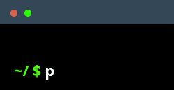

  

<!-- 

  

 -->

  
  <!--  -->

  
  

<!-- --- -->

  

    <h3>🚀 &nbsp; About Me</h3>
    <ul>
      <li>🌐 &nbsp;Check out my work at
        <a href="https://vtzy137.github.io" target="_blank">github.io</a>.
      </li>
      <li>
        🎓 &nbsp;Computer Science <a href="https://hust.edu.vn" target="_blank">HUST</a>.&nbsp;&nbsp;
        🎯 &nbsp;Solving problems on <a href="https://leetcode.com/u/VTzy137" target="_blank">LeetCode</a>
      </li>
      <li>
        💗 &nbsp;Runner, Minimalist, Visual Thinker
        | 🏃 🎨 |
        &nbsp;Passionate about Data, Web, and Bionic Algorithms 🧠
      </li>
    </ul>
  

  <!--  -->

  <blockquote align="right" style=" color: #495057; font-style: italic; ">
    <strong>"Amid the haze, where am I"</strong>
     
    -<em>here</em>
  </blockquote>

 

  <samp>
    <a href="https://web.telegram.org/k/#@VTzy137" target="_blank">telegram</a> .
    <a href="https://twitter.com/vtzy137" target="_blank">tweets</a> .
    <a href="https://bsky.app/profile/vtzy137.bsky.social" target="_blank">bluesky</a> .
    <a href="https://www.tumblr.com/vtzy137" target="_blank">tumblr</a> .
    <a href="https://beacons.ai/vtzy137" target="_blank">beacons</a> .
    <a href="https://vtzy137.github.io" target="_blank">about</a>
  </samp>

  <!--  -->
  <!--  -->

